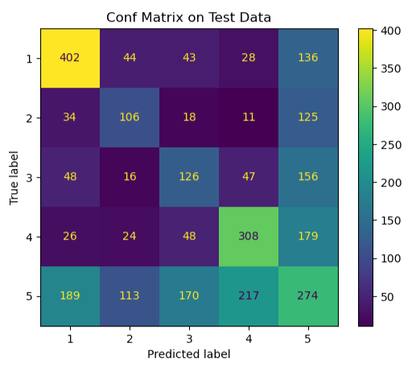

# p4-project


# Natural Language Processing Data Project

**"Natural Language Prodigies"**

**Authors**: [Heath Jones](mailto:jimmyhj9@gmail.com), [Yasitha De Alwis](mailto:ydealwis@gmail.com), [Nick Kai](mailto:nhknicholas@gmail.com), [Tristan Trechsel](mailto:tristantrechsel@gmail.com)

## Overview
We created an NLP ML model to help medical professionals in the retrieval of relevant information and in turn help them to 
save a significant portion of their time.


## Business Problem

Develop a highly accurate and reliable NLP model to automate the categorization of medical research papers into one of four major disease categories, thereby accelerating research, enhancing accessibility, and facilitating a more efficient allocation of medical expertise and resources.


## Data

Our data come from this [Kaggle dataset](https://www.kaggle.com/datasets/chaitanyakck/medical-text?select=train.dat), which includes over 14,000 medical research paper abstracts from 5 different categories, those categories being research papers that primarily focus on Neoplasms, Digestive diseases, Nervous system diseases, Cardiovascular diseases, and finally, General pathological disorders.

## Methods
To improve computational efficiency, we preprocessed the initial dataset by tokenizing, filtering out stopwords, lemmatizing, and finally removing common words that appeared in our classes.

We then began the modeling process by testing various algorithms varying from Logistic classifiers, Ensemble models, Neural networks, and various Vectorizers, including TF-IDF and Count vectorizer.

We then fine-tuned these models by adjusting various Hyperparameters to improve model accuracy.

After hitting a plateau in accuracy due to our models incorrectly classifying significant portions of class 5, we decided to drop it and focus on improving accuracy for our specific fields of study.

We then worked to reduce the dimensions of the data by using LSA and adjusting the number of components.

  
## Results
Our best model achieved an accuracy of 81.9% with our limited dataset, allowing medical professionals to better discover research papers, saving a significant amount of time.

</p>

## Conclusions
From this project, we reached the following conclusions Neural Networks tend to be the most efficient and effective way of parsing through large and complex datasets such as these. We also believe that if were able to access more data, we would be able to more effective train our neural network to achieve an even higher accuracy.
  

### Next Steps
- We would like to investigate other uses for our model, possibly looking into classifying insurance claims.
- We would like to train our neural network on even more data.
- We hope to add even more classes to our model to better classify research papers and provide more specific relevant results.
- We wish to explore improving our accuracy using an advanced vectorizer called Word2Vec
- We would like to investigate Sequential modeling and its possible applications in our model.


## For More Information

See the full analysis in the [Jupyter Notebook](./.ipynb), review this [presentation](./Presentation.pdf).

For additional info, contact Heath Jones at [@gmail.com](mailto:jimmyhj9@gmail.com), Yasitha De Alwis at [@gmail.com](mailto:ydealwis@gmail.com), Nick Kai at [nhknicholas@gmail.com](mailto:nhknicholas@gmail.com), or Tristan Trechsel at [tristantrechsel@gmail.com](mailto:tristantrechsel@gmail.com).


## Repository Structure

```
├── code
│   ├── data_cleaning.ipynb
│   ├── simple_models.ipynb
├── data
│   ├── train.dat
│   ├── train_cleaned.csv

├── images
├── .gitignore
├── README.md
└── Presentation.pdf
```
